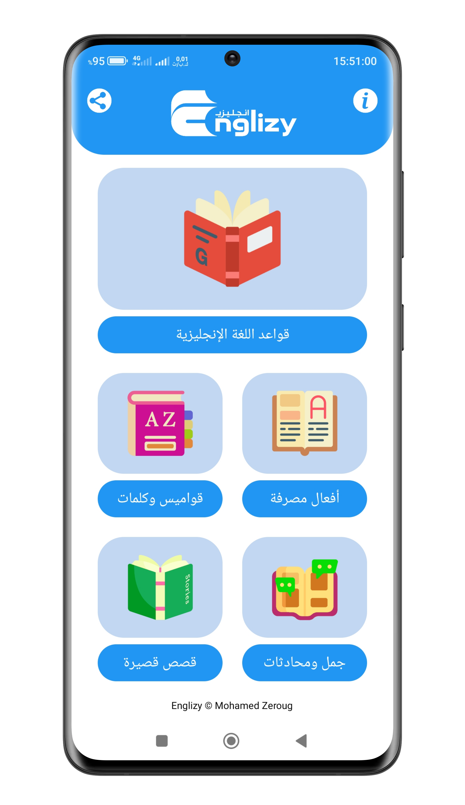
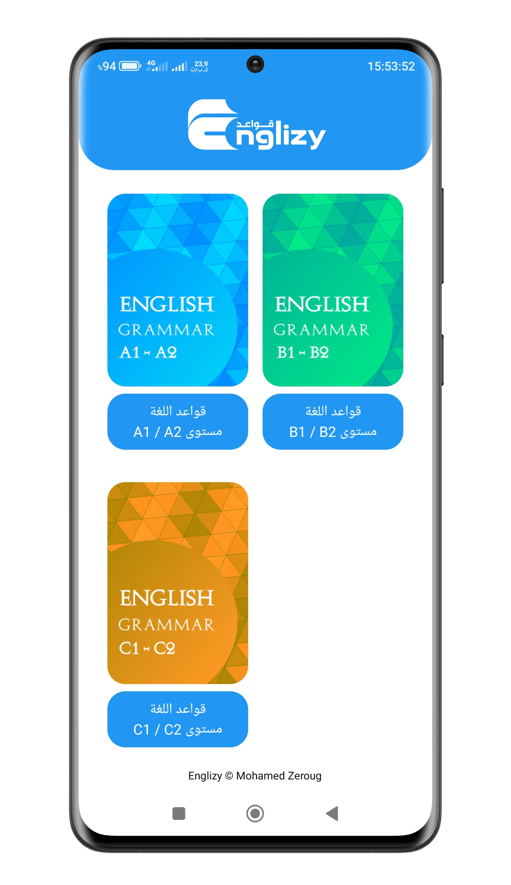
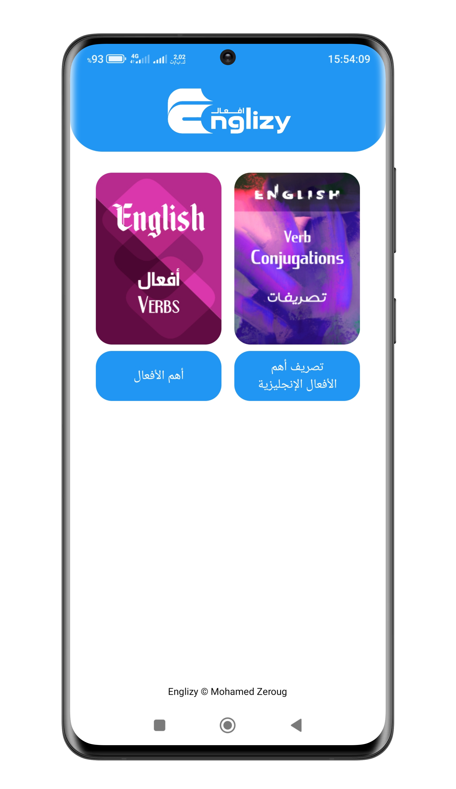
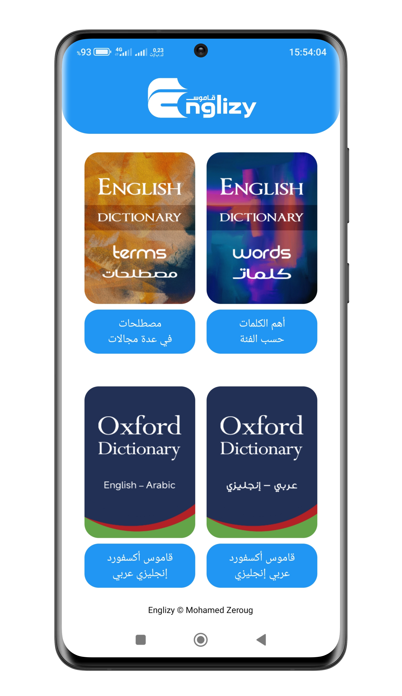
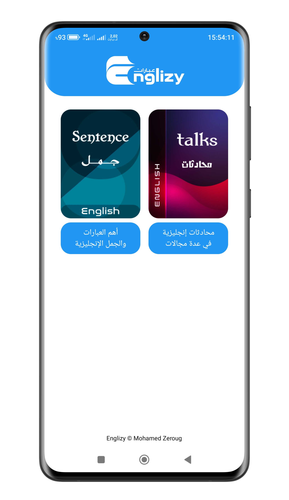
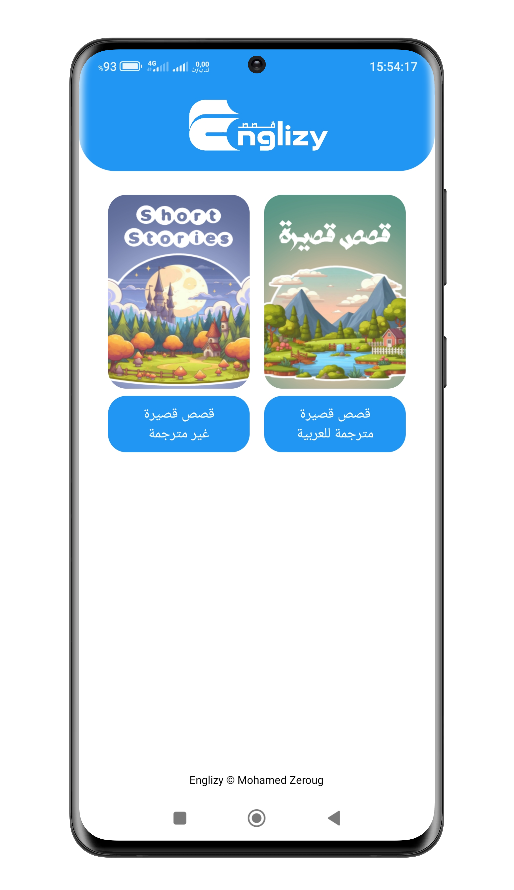
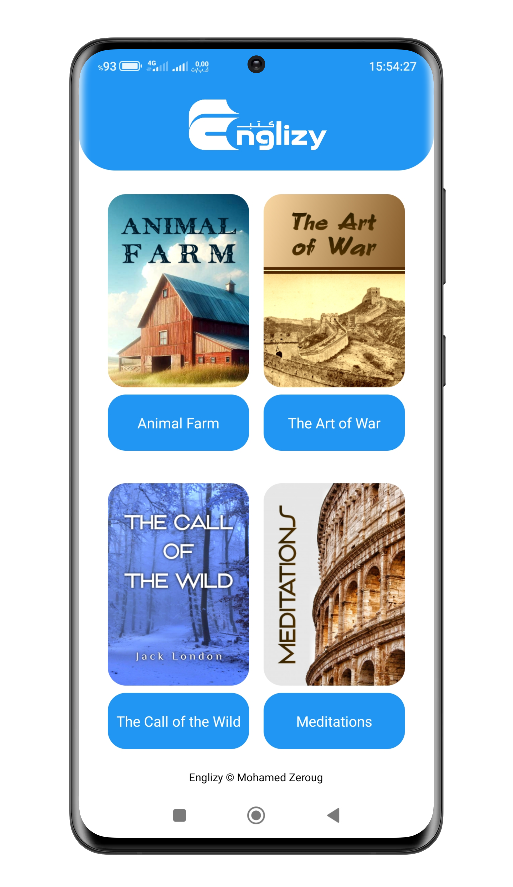
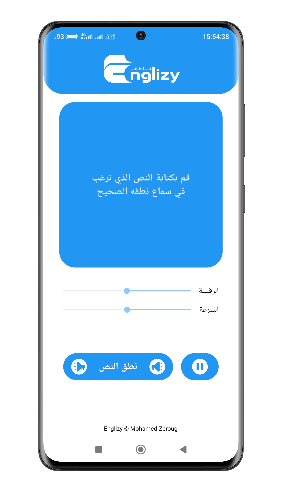
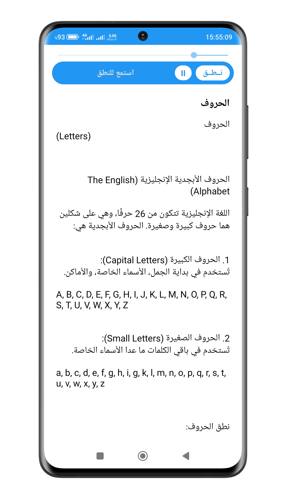

## Aves

![Version badge][Version badge]
![Build badge][Build badge]

Aves is a gallery and metadata explorer app. It is built for Android, with Flutter.

# English Learning App for Arabic Speakers

A comprehensive educational app designed to improve your English language skills offline, without the need for an internet connection.

# App Contents

- The most important English grammar rules, divided into multiple learning levels.

- Various dictionaries for words and expressions, plus hundreds of phrases and sentences.

- The most essential English verbs conjugated in all possible forms, including irregular ones.

- Hundreds of short stories and dozens of daily conversations.

- Ten complete, high-rated books.

- A text-to-speech converter with customizable voice options.

# Features

### High Flexibility

Fully responsive and optimized for all screen sizes, ensuring a seamless experience for every user.

### Offline Access

Designed to provide educational content even without an internet connection — ideal for users with limited connectivity.

### Exclusive Content

A rich collection of educational materials, available exclusively within this single application.

### Completely Free

No payments required and absolutely no intrusive ads — enjoy the full experience at no cost.

### Changelog

No payments required and absolutely no intrusive ads — enjoy the full experience at no cost.

# Screenshots

  
  
  

  
  
  

  
  
  

